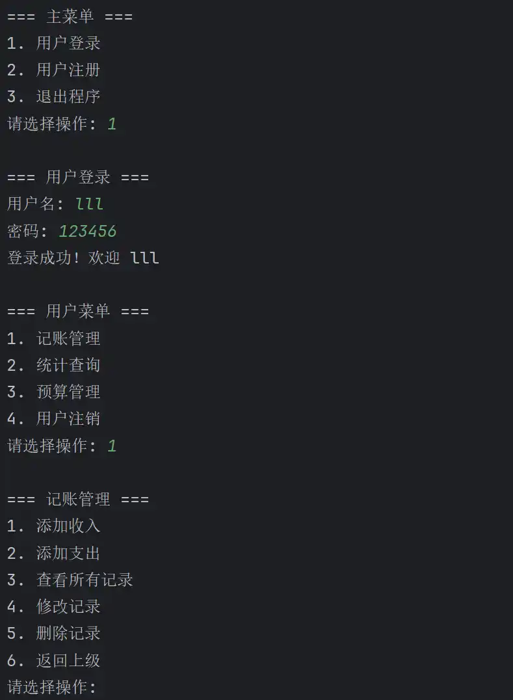

# Level1

本轮考核对语言没有限制，师弟师妹们可以选择主流开发语言实现考核内容。

- 无论师弟师妹们选择哪个方向，第一件要做的事情就是熟悉语言基础。因此，第一轮考核的要求是**使用自己选择的语言完成一个 “个人记账软件”**。

## 题目描述

- 设计一个个人记账系统，帮助用户记录零花钱收支并分析消费习惯。系统需要支持多用户使用，并提供基础记账功能和进阶管理功能。
- 完成基础功能，进阶功能为可选功能

- 可以自行发挥，添加其他功能，但需要保证业务逻辑正确。

## 基础功能

1. **用户管理**
   - 用户注册、登录
   - 用户数据隔离（不同用户数据互不干扰）
2. **记账功能**
   - 记录收入/支出（金额、类型、日期、备注）
   - 查看所有记录
   - 收入/支出的增删改查
3. **统计功能**
   - 统计总余额
   - 按类型统计收支（如 购物-200元, 餐饮-150元）
   - 统计消费类型及次数

## 进阶功能

1. **预算管理**
   - 设置本月预算
   - 计算剩余预算
2. **类型管理**
   - 预设消费类型（如预设 购物 餐饮 工资收入 等消费/收入场景）
   - 用户通过选择预设的消费类型存入记录
3. **管理员身份**
   - 管理员可以对类型进行增删

   - 管理员可以修改用户密码

4. **数据持久化**

- 也即程序关闭之后，用户、记录的账单等的信息不会消失，而是被保存到磁盘中，下次运行程序时可以被重新加载。

## 要求

- 不要求好看的前端界面，可以使用命令行窗口代替，如下：

